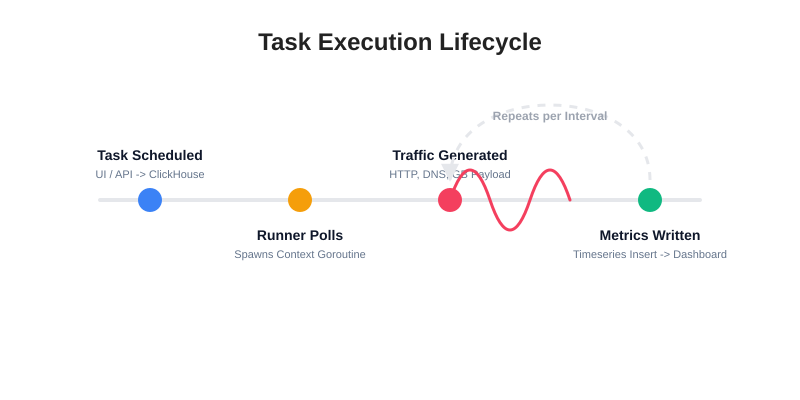
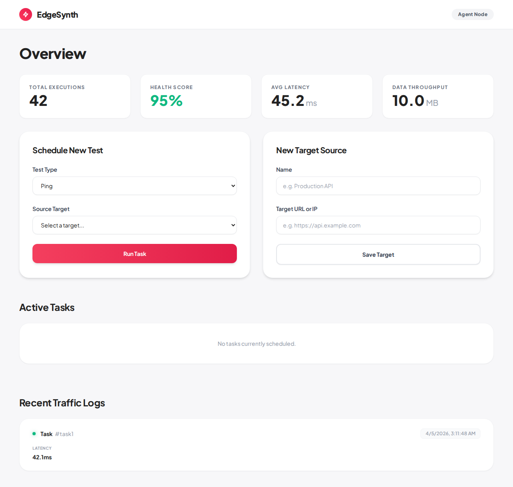
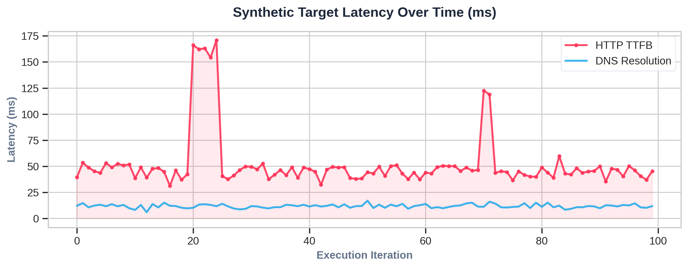
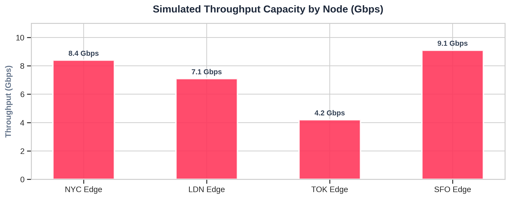

<div align="center">
  <h1>EdgeSynth</h1>
  <p><b>A modern, standalone synthetic traffic generator and network observability platform.</b></p>
  
</div>

---

## What is EdgeSynth?

EdgeSynth is an enterprise-grade, multi-platform solution for synthetic traffic generation and continuous network monitoring. Designed as a distributed, high-performance alternative to traditional tools (such as iperf, Cisco TRex, or Kentik Synthetics), EdgeSynth is built specifically to run natively as a single executable on edge network nodes.

Instead of managing complex, decoupled server-agent relationships, **EdgeSynth is entirely self-contained**. Deploying the single binary on any host immediately provisions a React-based observability dashboard while concurrently launching internal Go routines to execute, measure, and record synthetic network telemetry against designated local or global targets.

## Why EdgeSynth?

* **Zero-Dependency Deployment:** Distributed as a single, statically compiled Go binary with an embedded React user interface. No external runtimes (Node.js, Python, JVM) or complex configurations are required on the host machine.
* **Granular Network Observability:** Calculates deep lifecycle metrics including Time To First Byte (TTFB), DNS resolution latency, network path hops via ICMP/UDP tracing, and raw TCP/HTTP connection timings.
* **High-Throughput Synthetic Loads:** Capable of simulating micro-payloads (JSON REST calls) or saturating network links with gigabyte-scale data transfers (up to 5GB per test). Throughput is safely handled via memory-optimized stream discarding to prevent host resource exhaustion.
* **High-Performance Analytics:** Telemetry data is natively written to **ClickHouse** leveraging `MergeTree` storage engines, ensuring blistering fast analytical read performance and scalable timeseries retention.

<br/>
<div align="center">
  
</div>
<br/>

## Dashboard Interface

EdgeSynth features a clean, high-contrast, modern UI directly embedded inside the compiled Go binary.

<div align="center">
  
</div>
<br/>

## Network Performance Visualization

EdgeSynth tracks high-frequency data and can aggregate performance directly from ClickHouse, easily integrating with any observability stack (like Grafana) or its own dashboard.

<div align="center">
  
  <br/>
  <br/>
  
</div>
<br/>

## Key Capabilities

| Feature | Description |
| :--- | :--- |
| **ClickHouse Backend** | Utilizes ClickHouse `MergeTree` engines for highly efficient timeseries metric insertions and aggregations at scale. |
| **HTTP & DNS Tracing** | Captures detailed lifecycle telemetry (TTFB, DNS resolution time, Connection overhead) mimicking enterprise observability platforms. |
| **Network Path Discovery** | Executes native OS-level traceroute commands to capture routing hops and intermediate path statuses directly from the edge. |
| **Gigabyte Payloads** | Provides dedicated HTTP endpoints to generate and absorb arbitrary sizes of synthetic data to test network saturation and throughput limitations. |
| **PCAP Replay** | Replays captured network traffic profiles directly via `tcpreplay` over specific host interfaces (e.g. `eth0`), inspired by `CESNET/FlowTest`. |
| **Embedded Interface** | Features a zero-configuration, modern React dashboard served directly from the compiled Go binary memory space via `go:embed`. |

## Architecture Overview
1. The **EdgeSynth** application starts up, connects to your ClickHouse instance, and serves the API + Web UI.
2. The UI lets you configure new "Sources" (e.g. your production API, Github, or a 5GB loopback download).
3. You schedule tasks (Ping, TCP, Web Load, Traceroute, PCAP Replay).
4. An internal Go routine routinely polls the database for scheduled synthetic tasks and executes them asynchronously.
5. It natively executes the network tests and stores latency, success state, and throughput (Bytes Downloaded/Uploaded) back into ClickHouse.

---

## Building from Source

A `Makefile` is provided to seamlessly build the React UI and compile the Go binaries across platforms.

### Build All
```bash
make all
```

### Build Cross-Platform Release Binaries
```bash
make build-all-platforms
```

Binaries will be output in the `bin/` directory.

---

## Running EdgeSynth

### 1. Start ClickHouse
EdgeSynth requires ClickHouse to store its metrics. You can run it locally via Docker:
```bash
docker run -d --name clickhouse-server --ulimit nofile=262144:262144 -p 8123:8123 -p 9000:9000 clickhouse/clickhouse-server
```

### 2. Start the Application
By default, the binary will look for ClickHouse on `localhost:9000`.
```bash
./bin/edgesynth-linux-amd64 --port 8080
```

Open your browser to `http://localhost:8080` to view the dashboard and schedule tasks!

*(Optional)* You can override the database URL using the `DATABASE_URL` environment variable or the `--db` flag:
```bash
DATABASE_URL="clickhouse://default:@host:9000/default" ./bin/edgesynth-linux-amd64
```
